# [2020q3 Homework3 (quiz3)](https://hackmd.io/@sysprog/2020-quiz3)
contributed by < `CW-B-W` >

[GitHub](https://github.com/CW-B-W/sysprog2020q3-quiz3)

###### tags: `sysprog2020`

---

##### 感謝以下同學讓我參考，獲益良多
[RinHizakura](https://hackmd.io/@RinHizakura/SkjPS8vBP)  
[zhu849](https://hackmd.io/SeX_iB7VSG2n0ivpwJuDpg?both)  
[zzzxxx00019](https://hackmd.io/IK36k1DVRUq_1t3H9FpQgA?view)  
[nelsonlai1](https://hackmd.io/@nelsonlai1/2020q3_quiz3)  
[guaneec](https://hackmd.io/@guaneec/sp2020q3-quiz3)

---
##### 以下待參考

[Tim096](https://hackmd.io/@Tim096/ByYU-b7Iv)

## Outline
[TOC]

## Arithmetic Shift Right (測驗`1`)
### 為什麼需要 ASR(Arithmetic Shift Right)?
#### 問題：$(-2 >> 1)$ 應該是多少? (假設 8bit int)
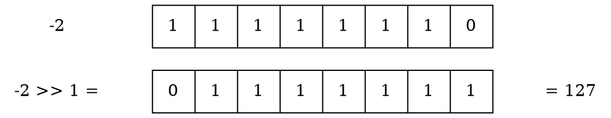
可以發現做了 Right shift 後，不僅從負數變成正數，並且絕對值還變大了

---

#### 一般來說，正整數 Right Shift 是做什麼用的？
因為二進位的特性，正整數做 Right Shift N bits 可以達到 $/2^N$ 的效果(無條件捨去)

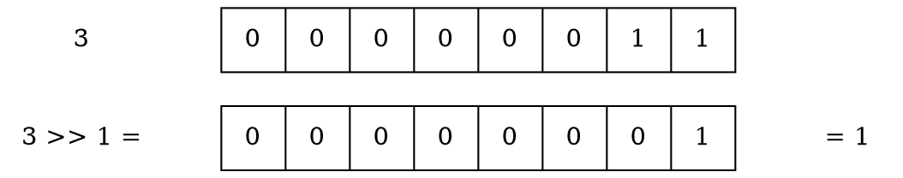

:::info
[C語言規格書 ISO/IEC 9899:TC2](http://www.open-std.org/jtc1/sc22/wg14/www/docs/n1124.pdf) 6.5.7 中
>The result of E1 >> E2 is E1 right-shifted E2 bit positions. If E1 has an unsigned type or if E1 has a signed type and a nonnegative value, **the value of the result is the integral part of the quotient of E1 / $2^{E2}$**.

定義了正整數的 Right Shfit N bits 應該為 $/2^N$
:::
那麼在負整數，如何沿用此法，以做到快速的負整數 $/2^N$ ?

---

#### 如何做到負整數 Right Shift N bits 等效於 $/2^N$ ?
觀察
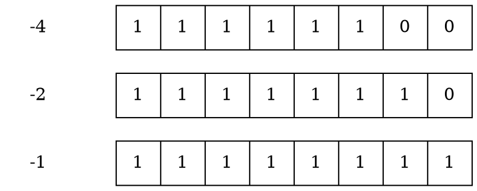
可發現只要`做負數 Right Shift 的時候，將左邊(MSB)補 1 即可`
這個做法(負數時將 MSB 補 1)稱為 [Sign Extension](https://en.wikipedia.org/wiki/Sign_extension)
相比之下，若將 MSB 補 0 則稱為 [Zero Extension](https://en.wikipedia.org/wiki/Sign_extension#Zero_extension)

:::info
在 [Verilog 規格書](https://ieeexplore.ieee.org/stamp/stamp.jsp?tp=&arnumber=1620780) 5.1.12 Shift operators 中
>  The logical right shift shall fill the vacated bit positions with zeroes. The arithmetic right shift shall fill the vacated bit positions with zeroes if the result type is unsigned. It shall fill the vacated bit positions with the value of the most significant (i.e., sign) bit of the left operand if the result type is signed.

可知 Verilog 支援兩種 Right Shfit Operator
1. $>>$
為 Logical Right Shift (LRS)，做 Zero Extension (MSB 補 0)
2. $>>>$
為 Arithmetic Right Shift (ARS)，做 Sign Extension (MSB 補 1)

(注意在 Verilog 裡，需用 signed 才會有效。否則 unsigned 裡，$>>$ 與 $>>>$ 等價)
:::

以下範例皆以
$>>$ 代表 Logical Right Shift
$>>>$ 代表 Arithmetic Right Shift

---

正確性證明：
考慮一負數$(<-1)$，為方便表示，顯示出其 Least Significant 1 (LS1) 
(在此假設是第 2 bit。假設 LS1 在其他位置，都可以得同樣結論)
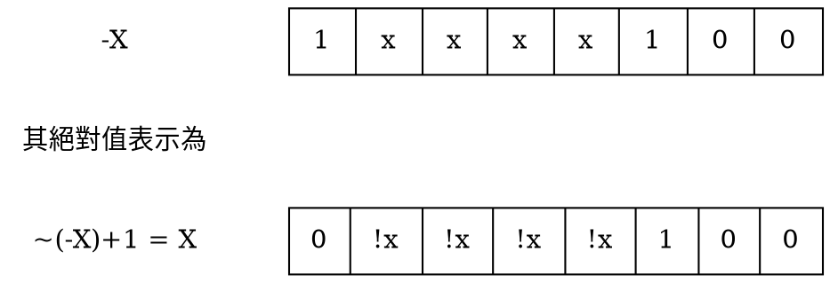
將其 Right Shift N bit
(在此假設 Right Shfit 2 bit。N 為不同數，都可以得同樣結論)
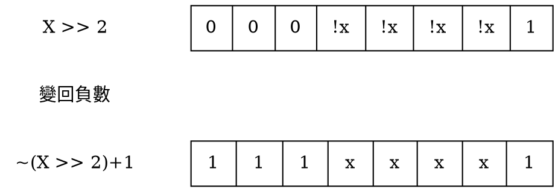
可發現確實只要在 MSB 補 1 即可

---

邊界情況：
當為 $-1$ 時，Arithmetic Right Shfit 不會得到 $0$，而會得到 $-1$
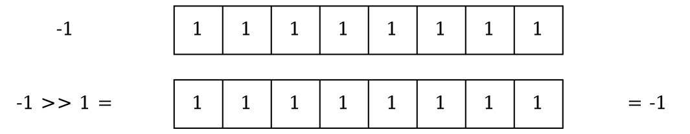

---

### C/C++ 支援 ASR 嗎？
[C語言規格書 ISO/IEC 9899:TC2](http://www.open-std.org/jtc1/sc22/wg14/www/docs/n1124.pdf) 6.5.7 中僅定義了兩個 Shfit Operator
1. $<<$
2. $>>$

並且根據
>The result of E1 >> E2 is E1 right-shifted E2 bit positions. If E1 has an unsigned type or if E1 has a signed type and a nonnegative value, the value of the result is the integral part of the quotient of E1 / $2^{E2}$. **If E1 has a signed type and a negative value, the resulting value is implementation-defined.**

可以得知 C 語言中，$>>$ 究竟是 Logical Right Shift 還是 Arithmetic Right Shfit 是 implementation-defined，並無強制規定。

---

#### 如何確認 Compiler 支不支援 ASR/LSR？
可以用 $-1$ 做 Right Shift 來確認
已知在 8bit int
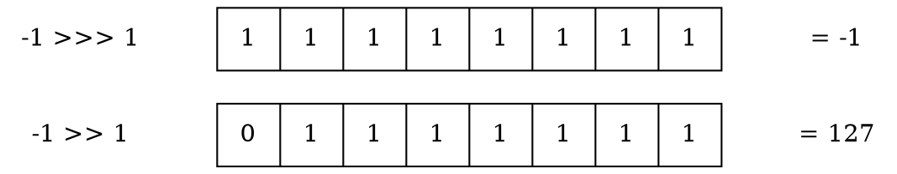
(注：$>>>$ 代表 Arithmetic Right Shift)
(注：$>>$ 代表 Logical Right Shift)

故我們可以利用 $>>$ 後的結果是 $>0$ or $<0$ 來判斷是否 Compiler 支援 ASR：
1. 若 $>>$ 後 $>0$，代表不支援 ASR
2. 若 $>>$ 後 $<0$，代表支援 ASR

如以下 C Macro
```CPP=
#define SUPPORT_ASR() \
    ((((int) -1) >> 1) < 0)
```

---

### 如果 Compiler 不支援 ASR/LSR ，那如何用 C code 實現 ASR/LSR？

#### Compiler 只支援 ASR，如何 C code 實做 LSR?
ASR 僅在 signed 時與 LSR 有差別，若想要強制在負數上使用 LSR，直接將數字轉為 unsigned 即可
```CPP=
#include <assert.h>
#define SUPPORT_ASR() \
    ((((int) -1) >> 1) < 0)
    
unsigned int lsr_i(unsigned int m, unsigned int n)
{
    return (m >> n);
}

int main(void) {
    assert(SUPPORT_ASR());
    assert(-1 >> 30 == -1);
    assert(lsr_i(-1, 30) == 3U);
    return 0;
}
```

---

#### Compiler 只支援 LSR，如何 C code 實做 ASR?
LSR 與 ASR 差在 MSB 是補 0 還是 補 1，故若 Compiler 不支援 ASR，可以(以下假設要對 X 做 Arithmetic Rigth Shfit N bits)
1. 先將 X 做 LSR N bits 得 Y
1. 做一個 Most Significant N bits 為 1，剩餘為 0 的 bitmask，得 Z
1. A = (Y | Z)
1. A 即為 X 做 ASR N bits 的結果

Example: 假設 
X = (int8_t) -8; N = 2
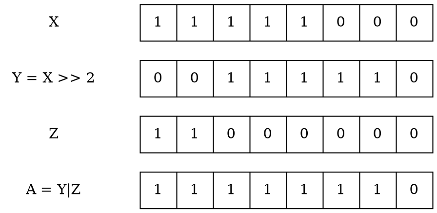
其中 bitmask Z 的做法，仍以
X = (int8_t) -8; N = 2
為例，欲得
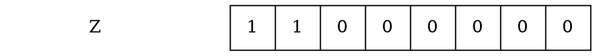
可先做 $(1<<(8-N))$
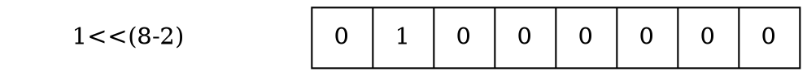
在 $-1$ 可將 Least Significant 1 後面全變成 1，LS1 變成0
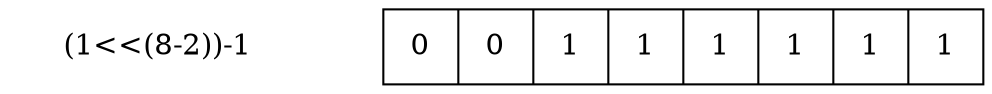
再取 $NOT$ 後即可
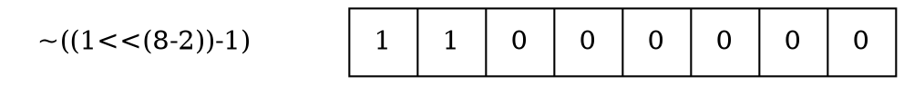
實作可如下
```CPP=
#include <assert.h>
#define SUPPORT_ASR() \
    ((((int) -1) >> 1) < 0)
    
int asr_i(signed int X, unsigned int N)
{
    if (SUPPORT_ASR()) {
    	return X >> N;
    }
    else {
    	int Y = (unsigned)X >> N;
    	int Z = ~((1 << (sizeof(int)*8-N)) - 1);
    	return Y | Z;
    }
}

int main(void) {
    assert(SUPPORT_ASR());
    assert(-1 >> 30 == -1);
    assert(asr_i(-1, 30) == -1);
    return 0;
}
```

---

對應 jserv 老師 quiz3 的 code
```CPP=
int asr_i(signed int m, unsigned int n)
{
    const int logical = (((int) -1) >> 1) > 0;
    unsigned int fixu = -(logical & (m < 0));
    int fix = *(int *) &fixu;
    return (m >> n) | (fix ^ (fix >> n));
}
```
其作法流程為
1. 確認是否支援 ASR
    * 若 logical 為 true，則只支援 LSR
1. 做出 bitmask
    * 分兩種情況
        1. 只支援 LSR 且 $(m < 0)$，則 fixu 會等於 $-(1)$
        2. Otherwise，fixu 等於 $-(0)$ (不需要 bitmask)
    * Case 1.
        * fix = 32'b1111_1..1_1111
        * (fix >> n) = 32'b0..._..._...1
        * fix^(fix>>n) 即為 bitmask
    * Case 2.
        * fix = 32'b0000_0..0_0000
        * (fix >> n) = 32'b0000_0..0_0000
        * fix^(fix>>n) 即為 bitmask = 0
1. 將 $(m>>n)$ 與 bitmask 做 $OR$

以下以
m = (int8_t) -8; n = 2
用圖示示例

---

Case 1. 只支援 LSR 且 $(m < 0)$
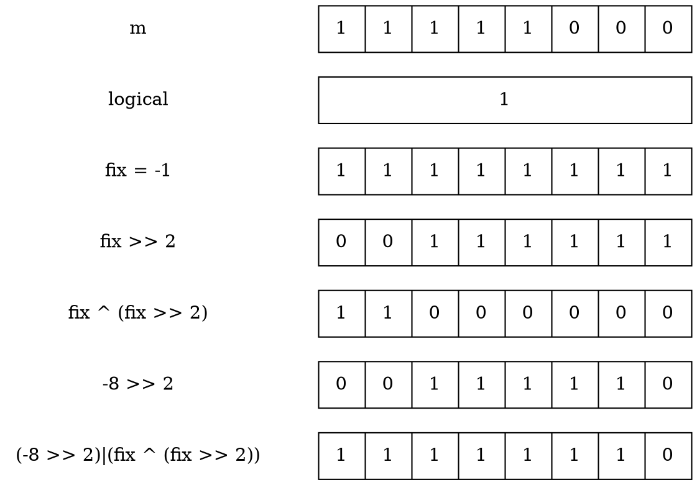

---

Case 2. 支援 ASR 且 $(m < 0)$
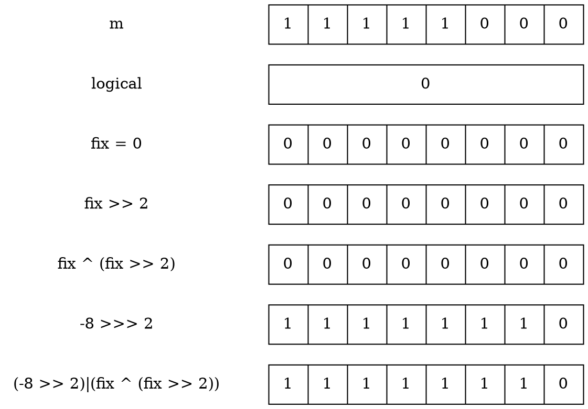

---

### 以 Macro 實作其他資料寬度 ASR (延伸問題 2.)
#### 原始想法
* 將原本的 ASR 裡面的 `int` 改成 `intx_t` ， 並將 ASR 用 `do{}while(0)` 包裝
    * `do{}while(0)` 
        * Reference: [C: do {…} while(0)?](https://stackoverflow.com/questions/2687569/c-do-while0)
* 之後實作 `int8_t`, `int16_t`, etc. 的 wrapper function
    * 裡面用 `#define intx_t int8_t` 這種方式重新定義 `intx_t`
```CPP=
#define ASR(m, n)                                                              \
    do {                                                                       \
        const intx_t logical = (((intx_t)-1) >> 1) > 0;                          \
        uintx_t fixu = -(logical & (m < 0));                                    \
        intx_t fix = *(intx_t *)&fixu;                                           \
        return (m >> n) | (fix ^ (fix >> n));                                  \
    } while (0);

int8_t asr_8(int8_t m, uint8_t n){
#define intx_t int8_t
#define uintx_t uint8_t
    ASR(m, n)
#undef intx_t
#undef uintx_t
}

int16_t asr_16(int16_t m, uint16_t n){
#define intx_t int16_t
#define uintx_t uint16_t
    ASR(m, n)
#undef intx_t
#undef uintx_t
}

int32_t asr_32(int32_t m, uint32_t n)
{
#define intx_t int32_t
#define uintx_t uint32_t
    ASR(m, n)
#undef intx_t
#undef uintx_t
}

#undef ASR
```
將 Macro 展開，並用 clang-format 排版
```
gcc c11generic.c -E -o c11generic.i --std=c11
```
```cpp=
# 1 "c11generic.c"
# 1 "<built-in>" 1
# 1 "<built-in>" 3
# 364 "<built-in>" 3
# 1 "<command line>" 1
# 1 "<built-in>" 2
# 1 "c11generic.c" 2

int8_t asr_8(int8_t m, uint8_t n) {
  do {
    const int8_t logical = (((int8_t)-1) >> 1) > 0;
    uint8_t fixu = -(logical & (m < 0));
    int8_t fix = *(int8_t *)&fixu;
    return (m >> n) | (fix ^ (fix >> n));
  } while (0);
}

int16_t asr_16(int16_t m, uint16_t n) {
  do {
    const int16_t logical = (((int16_t)-1) >> 1) > 0;
    uint16_t fixu = -(logical & (m < 0));
    int16_t fix = *(int16_t *)&fixu;
    return (m >> n) | (fix ^ (fix >> n));
  } while (0);
}

int32_t asr_32(int32_t m, uint32_t n) {
  do {
    const int32_t logical = (((int32_t)-1) >> 1) > 0;
    uint32_t fixu = -(logical & (m < 0));
    int32_t fix = *(int32_t *)&fixu;
    return (m >> n) | (fix ^ (fix >> n));
  } while (0);
}
```

---

#### 參考 [RinHizakura 同學的做法](https://hackmd.io/@RinHizakura/SkjPS8vBP)
學到可用 C11 _Generic
```CPP=
#define asr_i(m, n) \
    _Generic((m), \
             int8_t: asr_i8, \
             int16_t: asr_i16, \
             int32_t: asr_i32, \
             int64_t: asr_i64 \
    )(m,n)
 
#define asr(type) \
    const type logical = (((type) -1) >> 1) > 0; \
    u##type fixu = -(logical & (m < 0)); \
    type fix = *(type *) &fixu; \
    return (m >> n) | (fix ^ (fix >> n))

int8_t asr_i8(int8_t m, unsigned int n)
{
    asr(int8_t);
}
int16_t asr_i16(int16_t m, unsigned int n)
{
    asr(int16_t);
}
int32_t asr_i32(int32_t m, unsigned int n)
{
    asr(int32_t);
}
int64_t asr_i64(int64_t m, unsigned int n)
{
    asr(int64_t);
}
```
將 Macro 展開，並用 clang-format 排版
```
gcc c11generic.c -E -o c11generic.i --std=c11
```
```cpp=
# 1 "c11generic.c"
# 1 "<built-in>" 1
# 1 "<built-in>" 3
# 364 "<built-in>" 3
# 1 "<command line>" 1
# 1 "<built-in>" 2
# 1 "c11generic.c" 2
# 15 "c11generic.c"
int8_t asr_i8(int8_t m, unsigned int n) {
  const int8_t logical = (((int8_t)-1) >> 1) > 0;
  uint8_t fixu = -(logical & (m < 0));
  int8_t fix = *(int8_t *)&fixu;
  return (m >> n) | (fix ^ (fix >> n));
}
int16_t asr_i16(int16_t m, unsigned int n) {
  const int16_t logical = (((int16_t)-1) >> 1) > 0;
  uint16_t fixu = -(logical & (m < 0));
  int16_t fix = *(int16_t *)&fixu;
  return (m >> n) | (fix ^ (fix >> n));
}
int32_t asr_i32(int32_t m, unsigned int n) {
  const int32_t logical = (((int32_t)-1) >> 1) > 0;
  uint32_t fixu = -(logical & (m < 0));
  int32_t fix = *(int32_t *)&fixu;
  return (m >> n) | (fix ^ (fix >> n));
}
int64_t asr_i64(int64_t m, unsigned int n) {
  const int64_t logical = (((int64_t)-1) >> 1) > 0;
  uint64_t fixu = -(logical & (m < 0));
  int64_t fix = *(int64_t *)&fixu;
  return (m >> n) | (fix ^ (fix >> n));
}
```

可看出以上兩種 Macro 作法結果一樣，但用 `C11 _Generic` 寫起來比較漂亮

---

### C11 _Generic v.s. C++ function overloading
:::danger
TODO  
C++ is a meta language  
C 為了簡單，所以不做 function overloading，編譯器難寫，!!驗證難!!
:::

---

## Is Power of Four (測驗`2`)

### 如何確認一個數是否為 2 的冪次

#### math version
用 math.h 的 log2 硬幹，確認 log2(n) 是否小數部分為 0 即可
```cpp=
int isPowerOfTwo_math(int n) {
    if (n == 0)
		return 0;
	double lg = log2(n);
	return lg == (int)lg;
}
```
:::info
此實作利用 C 的 conversion 規則
```cpp=5
	return lg == (int)lg;
```
可分成三步驟

---
Step 1. (explicit conversion)
```cpp
(int) lg
```
此時 lg 的小數部分被刪除 (見下方 1.)

---
Step 2. (implicit conversion)
```cpp
(double) ((int) lg) // converted implicitly
```
在與 lg 比較前，會被 implicitly convert 成 double (見下方 2.)

---
Step 3. (comparison using double)
```cpp
lg == (double) ((int) lg)
```

---
1. [C語言規格書 ISO/IEC 9899:TC2](http://www.open-std.org/jtc1/sc22/wg14/www/docs/n1124.pdf) 6.3.1.4 定義了 real floating 轉型 int 時，小數部分應該被捨棄
>When a finite value of real floating type is converted to an integer type other than _Bool,
**the fractional part is discarded (i.e., the value is truncated toward zero).**

2. [C語言規格書 ISO/IEC 9899:TC2](http://www.open-std.org/jtc1/sc22/wg14/www/docs/n1124.pdf) 6.3.1.8 定義了 implicit conversion 順序:
long double > double > float > unsigned ...
>This pattern is called the usual arithmetic conversions:
>First, if the corresponding real type of either operand is long double, the other
operand is converted, without change of type domain, to a type whose
corresponding real type is long double.
>Otherwise, if the corresponding real type of either operand is double, the other
operand is converted, without change of type domain, to a type whose
corresponding real type is double.
:::

---

#### Naive version
一直 $/2$，如果沒辦法整除，就不是 ($2^N$)
```cpp=
int isPowerOfTwo_Naive(int n) {
	if (n == 0)
		return 0;
	while (n != 1) {
		if (n % 2 != 0)
			return 0;
		n /= 2;
	}
	return 1;
}
```

---

#### bitwise-operation version
以 bitwise 的角度思考，$2^N$ 代表什麼？
=> $2^N$ iff 只有一個 bit 為 1

---

如何確認是否只存在一個 1?
可利用 lowest bit (least significant one)
```
lowest bit of n = (n & -n)
```
可參考 [Bit Twiddling Hacks](https://graphics.stanford.edu/~seander/bithacks.html)
>The expression (v & -v) extracts the least significant 1 bit from v.

說明：
以 8 bits 整數說明
假設數字 X，其 lowest bit 在第 k 個 bit
在此示例 k = 3
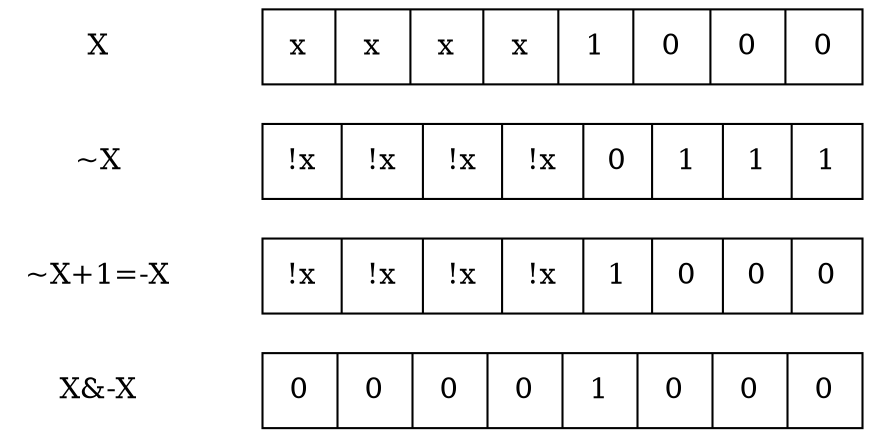
因為 lowest bit ~ 第 0 個 bit 取負數後，都不會有變動，故可以用 $AND$ 找出 lowest bit

---

找到 lowest bit，然後呢？
=> 只存在一個 bit，則其必為 lowest bit，並且將其 toggle 掉後，數字即變為 0

故

0. 邊界條件: if N is 0, then N is not power of two
1. 找出 N 的 lowest bit
2. M = N ^ (lowest bit)
3. if M is 0, then N is power of two

```cpp=
int isPowerOfTwo_LowestBit(int n) {
	return n > 0 && !(n ^ (n&-n));
}
```

若只是要將 lowest bit toggle 掉，可直接用
```
n & (n-1)
```

說明：
以 8 bits 整數說明
假設數字 X，其 lowest bit 在第 k 個 bit
在此示例 k = 3
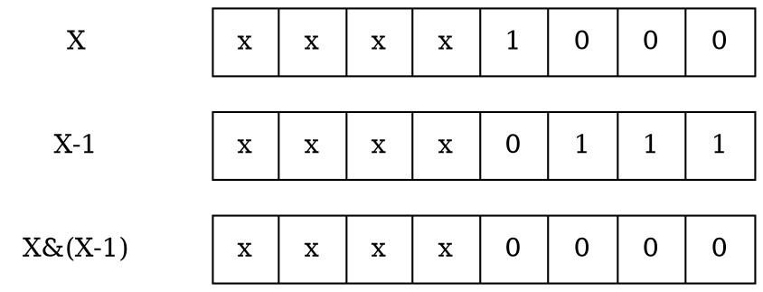
因為 lowest bit ~ 第 0 個 bit 減 1 後會退位，故可以用 $AND$ 找出 lowest bit 以上剩餘的數字

```cpp=
int isPowerOfTwo_LowestBit(int n) {
	return n > 0 && !(n & (n-1));
}
```

---

### 如何確認一個數是否為 4 的冪次
與 isPowerOfTwo 有何異同
* 同：
    * 都只會有一個 bit 為 1
* 異：
    * 若此 bit 1 是在奇數位(1, 3, 5)，則其並非 4 的冪次

可得出規則，如果 N
1. 是 2 的冪次
2. N 的 trailing zeros 有偶數個
則 N 為 4 的冪次

---

#### 如何快速求 trailing zeros 數量?

:::danger
TODO
:::

---
藉由 ctz 可寫出以下 C code
```CPP=
bool isPowerOfFour(int num)
{
    return num > 0 && (num & (num - 1))==0 &&
           !(__builtin_ctzl(num) & 0x1);  
}
```

將其轉為 assembly code
```
gcc -S isPowerOfFour.c -o isPowerOfFour.s -O2
```

```
	.section	__TEXT,__text,regular,pure_instructions
	.build_version macos, 10, 15	sdk_version 10, 15, 4
	.globl	__Z13isPowerOfFouri     ## -- Begin function _Z13isPowerOfFouri
	.p2align	4, 0x90
__Z13isPowerOfFouri:                    ## @_Z13isPowerOfFouri
	.cfi_startproc
## %bb.0:
	pushq	%rbp
	.cfi_def_cfa_offset 16
	.cfi_offset %rbp, -16
	movq	%rsp, %rbp
	.cfi_def_cfa_register %rbp
                                        ## kill: def $edi killed $edi def $rdi
	testl	%edi, %edi
	jle	LBB0_3
## %bb.1:
	leal	-1(%rdi), %eax
	testl	%edi, %eax
	je	LBB0_5
LBB0_3:
	xorl	%eax, %eax
                                        ## kill: def $al killed $al killed $eax
	popq	%rbp
	retq
LBB0_5:
	bsfl	%edi, %eax
	testb	$1, %al
	sete	%al
                                        ## kill: def $al killed $al killed $eax
	popq	%rbp
	retq
	.cfi_endproc
                                        ## -- End function

.subsections_via_symbols
```
總共有兩個 branches (conditional jump)
下面探討如何優化

---

### isPowerOfFour - Branch 優化 (延伸問題 2.)
降低 branch 數量

#### Version 1 (2 branches)
```cpp=
bool isPowerOfFour(int num)
{
    return num > 0 && (num & (num - 1)) == 0 && !(__builtin_ctz(num) & 0x1);
}
```
---

#### Version 2 (1 branch)
Version 0 中，`&&` 造成需要 branch，故嘗試將 `&&` 移除
```cpp=
bool isPowerOfFour_LessBranch(int num)
{
    return (num > 0) & ((num & (num - 1)) == 0) & !(__builtin_ctz(num) & 0x1);
}
```
但實際執行時，若 $num = 0$ 則會發生錯誤，因為原本使用的 `&& operator` 在
[C語言規格書 ISO/IEC 9899:TC2](http://www.open-std.org/jtc1/sc22/wg14/www/docs/n1124.pdf) 6.5.13 提到
>Unlike the bitwise binary & operator, the && operator guarantees left-to-right evaluation;
there is a sequence point after the evaluation of the first operand. If the first operand
compares equal to 0, the second operand is not evaluated.

意即 `&& operator` 會先確定 first operand ($num > 0$) 不為 false，才會去執行 second operand，因此避免了 $num = 0$ 被傳入 ctz，但也因此用 `&& operator` 一定會產生 branch

將錯誤修復後的 C code
```cpp=
bool isPowerOfFour_LessBranch(int num)
{
    return (num > 0) && ((num & (num - 1)) == 0) & !(__builtin_ctz(num) & 0x1);
}
```

將其轉為 assembly code，可見其剩下 1 branch
```
gcc -S isPowerOfFour_LessBranch.c -o isPowerOfFour_LessBranch.s -O2
```

```
	.section	__TEXT,__text,regular,pure_instructions
	.build_version macos, 10, 15	sdk_version 10, 15, 4
	.globl	__Z24isPowerOfFour_LessBranchi ## -- Begin function _Z24isPowerOfFour_LessBranchi
	.p2align	4, 0x90
__Z24isPowerOfFour_LessBranchi:         ## @_Z24isPowerOfFour_LessBranchi
	.cfi_startproc
## %bb.0:
	pushq	%rbp
	.cfi_def_cfa_offset 16
	.cfi_offset %rbp, -16
	movq	%rsp, %rbp
	.cfi_def_cfa_register %rbp
                                        ## kill: def $edi killed $edi def $rdi
	testl	%edi, %edi
	jle	LBB0_1
## %bb.2:
	leal	-1(%rdi), %eax
	xorl	%ecx, %ecx
	testl	%edi, %eax
	sete	%cl
	bsfl	%edi, %eax
	notl	%eax
	testl	%ecx, %eax
	setne	%al
                                        ## kill: def $al killed $al killed $eax
	popq	%rbp
	retq
LBB0_1:
	xorl	%eax, %eax
                                        ## kill: def $al killed $al killed $eax
	popq	%rbp
	retq
	.cfi_endproc
                                        ## -- End function

.subsections_via_symbols
```

---

#### Version 3 (0 branch)
Version 1 與 Version 2 問題都在於 $num = 0$ 時 ctz 會出錯，那是否可以針對 $num = 0$ 時做特殊處理，使得結果一樣，且 ctz 不會出錯？
=> 直接在 ctz 的輸入，將 num 的 MSB 設為 1

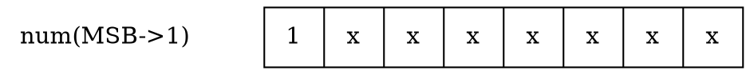

如 C code 所示
```cpp
!(__builtin_ctz(num|(1<<31)) & 0x1);
```

因為
1. toggle lowest bit 的部分沒有變動到，所以此部分一定正確
2. ctz 的結果最多為 $(BitWidth - 1)$，故將 MSB 設為 1 ，並不會影響到 ctz 的結果

```cpp=
bool isPowerOfFour_Branchless(int num)
{
    return ((num & (num - 1)) == 0) & !(__builtin_ctz(num|(1<<31)) & 0x1);
}
```

將其轉為 assembly code，可見其完全沒有 branch
```
gcc -S isPowerOfFour_Branchless.c -o isPowerOfFour_Branchless.s -O2
```

```
	.section	__TEXT,__text,regular,pure_instructions
	.build_version macos, 10, 15	sdk_version 10, 15, 4
	.globl	_isPowerOfFour_Branchless ## -- Begin function isPowerOfFour_Branchless
	.p2align	4, 0x90
_isPowerOfFour_Branchless:              ## @isPowerOfFour_Branchless
	.cfi_startproc
## %bb.0:
	pushq	%rbp
	.cfi_def_cfa_offset 16
	.cfi_offset %rbp, -16
	movq	%rsp, %rbp
	.cfi_def_cfa_register %rbp
	movl	%edi, -4(%rbp)
	movl	-4(%rbp), %eax
	movl	-4(%rbp), %ecx
	subl	$1, %ecx
	andl	%ecx, %eax
	cmpl	$0, %eax
	sete	%dl
	andb	$1, %dl
	movzbl	%dl, %eax
	movl	-4(%rbp), %ecx
	orl	$-2147483648, %ecx      ## imm = 0x80000000
	bsfl	%ecx, %ecx
	andl	$1, %ecx
	cmpl	$0, %ecx
	setne	%dl
	xorb	$-1, %dl
	andb	$1, %dl
	movzbl	%dl, %ecx
	andl	%ecx, %eax
	popq	%rbp
	retq
	.cfi_endproc
                                        ## -- End function

.subsections_via_symbols
```

---
### Branch vs Branchless效能分析

先來一篇科普文章看看 branch prediction 對程式效能的貢獻
[Why is processing a sorted array faster than processing an unsorted array?](https://stackoverflow.com/questions/11227809/why-is-processing-a-sorted-array-faster-than-processing-an-unsorted-array)


比較以下 5 個版本
```cpp=
bool isPowerOfFour_math(int n)
{
    if (n == 0)
        return 0;
    double lg = log2(n);
    return (lg == (int)lg) & !((int)lg & 1);
}

bool isPowerOfFour_Naive(int num)
{
    int n = 1;
    while (n > 0) {
        if (n == num)
            return true;
        n *= 4;
    }
    return false;
}

bool isPowerOfFour(int num)
{
    return num > 0 && (num & (num - 1)) == 0 && !(__builtin_ctz(num) & 0x1);
}

bool isPowerOfFour_LessBranch(int num)
{
    return (num > 0) && ((num & (num - 1)) == 0) & !(__builtin_ctz(num) & 0x1);
}

bool isPowerOfFour_Branchless(int num)
{
    return ((num & (num - 1)) == 0) & !(__builtin_ctz(num|(1<<31)) & 0x1);
}
```

循序輸入 [0, $2^{20}$) 至 isPowerOfFour，並重複測試 100 次

2 branches 竟然是最快的! **因為 branch prediction 命中率很高(容易猜中)**


---

#### 如何使 branch prediction 命中率降低，凸顯 branchless 的優勢？

因為上面實驗為循序輸入，並只有第一個輸入為 $num = 0$，branch predictor 很容易能猜中，因此 branchless 看起來沒什麼優勢。


為了比較 branch vs branchless，下面設計實驗使 branch predictor 不容易猜中

testdata 為 [0, $2^{19}$) 與 $2^{19}$  個 0 的集合(共 $2^{20}$ 個數字)，並將此集合 random shuffle

如此 branch 就不具規律性，猜中率會降低
圖中顯示 branchless 在此情況(branch prediction 難以預測)下確實較具優勢


---

### ctz, clz 應用於 LeetCode (延伸問題 3.)
#### [LeetCode 1009. Complement of Base 10 Integer](https://leetcode.com/problems/complement-of-base-10-integer)
題意：
求非負整數 $N$ 的 $NOT$，結果的 bitwidth 必須與 N 相同
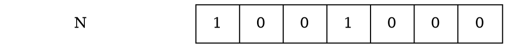
注意 $N$ 與 $\sim N$ 的 bitwidth 並不一樣，$\sim N$ 只有 7 bits
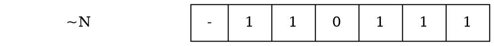

解法：
直接用 `~ operator` ，並利用 `clz` 做出 bit-mask 以達到指定 bitwidth 即可
```CPP=
int bitwiseComplement(int N){
    if (N)
        return ~N & ((1<<(32-__builtin_clz(N)))-1);
    return 1;
}
```
但這樣需要考慮 $N = 0$ 時不能用 clz，需要特判、又有 branch
可以利用上面消除 `isPowerOfFour` branch 的方法，做
```cpp
__builtin_clz(N|1)
```
```cpp=
int bitwiseComplement(int N) {
        return ~N & ((1<<(32-__builtin_clz(N|1)))-1);
}
```
就可以漂亮地解決問題


---

#### [LeetCode 41. First Missing Positive](https://leetcode.com/problems/first-missing-positive/)
題意：
給一個未排序整數 array，問沒出現在 array 中的正整數最小為多少

思路：
從規格(測資)下手，發現`nums.length <= 300`
可以推知，**`missing positive` 最大只會是 301**

* 因為要讓 `missing positive` 最大，只能將 1~300 都放在 array 中，否則 1~300 間必有一數缺失

因為缺失數字一定在 1~301 之間，故只需要用 bitset 紀錄 1~301 間哪些數字出現過即可

解法：


```CPP=
#include <stdint.h>

int firstMissingPositive(int* nums, int numsSize){
    uint64_t bitset[5] = {~0UL-1, ~0UL, ~0UL, ~0UL, ~0UL}; /* 320bits */
    for (int i = 0; i < numsSize; ++i) {
        if (0 < nums[i] && nums[i] <= numsSize) {
            register uint64_t num = nums[i];
            uint64_t blk = num / 64;
            uint64_t idx = num % 64;
            bitset[blk] &= ~(1UL << idx);
        }
    }
    for (int i = 0; i < 5; ++i) {
        if (bitset[i]) {
            return __builtin_ctzll(bitset[i]) + 64*i;
        }
    }
    return -1; /* something error happens */
}
```


---

### Golomb coding 與 x-compressor

[From Wikipedia](https://en.wikipedia.org/wiki/Golomb_coding)
>Golomb coding is a lossless data compression method using a family of data compression codes invented by Solomon W. Golomb in the 1960s. Alphabets following a geometric distribution will have a Golomb code as an optimal prefix code,[1] making Golomb coding highly suitable for situations in which the occurrence of small values in the input stream is significantly more likely than large values.


#### 基礎知識 - Unary coding
規則很簡單，要 encode 數字 $n$，就寫出 $n$ 個 $1$，最後尾端加上一個 $0$ 即可
```cpp=
void printUnaryEncoding(int n)
{
    while (n--)
        printf("1");
    printf("0");
}
```
總共用 n+1 bits，只適合小數字壓縮

#### Golomb-Rice coding
先選一數字 $m=2^k$，將 $n / m$ 做 `Unary coding`，將 $n \% m$ 的 bits 直接接在尾端
因為 $m$ 為 2's power，所以 $n / m$ 與 $n \% m$ 可直接用 bitwise 處理
```cpp=+
void printBits(int n);

void printGolombRichEncoding(int n, int m)
{
    assert((m&(m-1)) == 0);     // make sure m is 2^k
    
    int k = __builtin_ctz(m);
    printUnaryEncoding(n >> k); // equivalent to (n / m) when m is 2^k
    
    int remainder = n & (m-1);  // equivalent to (n % m) when m is 2^k
    printBits(remainder);
}

void printBits(int n)
{
    int i = 1 << (31-__builtin_clz(n));
    while (i) {
        if (i & n)
            printf("1");
        else
            printf("0");
        i >>= 1;
    }
}
```

#### Golomb-Rice coding 原理說明


:::danger

:::

---

### 將 x-compressor 修改為 Exponential-Golomb coding

:::danger

:::

---

### Exponential Golomb coding 用例

:::danger
[From Wikipedia](https://en.wikipedia.org/wiki/Exponential-Golomb_coding)
>Exp-Golomb coding is used in the H.264/MPEG-4 AVC and H.265 High Efficiency Video Coding video compression standards, ...
:::

---

### Golomb-Rich vs Exponential-Golomb

:::danger

:::

---

## GNU extension functions (測驗`3`)

### gcc built-in bitwise functions

:::danger
[TODO]
[6.59 Other Built-in Functions Provided by GCC](https://gcc.gnu.org/onlinedocs/gcc/Other-Builtins.html)

ctz, clz, popcount, etc. 內部如何實作?
:::

---

### [LeetCode 1342. Number of Steps to Reduce a Number to Zero](https://leetcode.com/problems/number-of-steps-to-reduce-a-number-to-zero/)

先試用 Naive Version (測資很弱，Naive 就可以 faster than 100%)
```cpp=
int numberOfSteps (int num)
{
    int cnt = 0;
    while (num) {
        if (num % 2 == 0)
            num /= 2;
        else
            num -= 1;
        cnt++;
    }
    return cnt;
}
```
利用 bitwise operation 可以更有效率的求解
1. 當 LSB 為 0，Right Shift 1 bit
2. 當 LSB 為 1，Toggle LSB

可以歸納出需要操作的次數為
1. 每次遇到 1 都必須要 1 次操作
2. 在 Most Significant One ~ 第 0 bit 間的所有數字都必須被 right shift 到底 1 次

所以總次數可以直接算得，為
`1 的個數` + `most significant one 的位置`
利用 `popcount` 可算出 `1 的個數`
利用 `31 - clz` 可算出 `most significant one` 的位置
```CPP=
int numberOfSteps (int num)
{
    return num ? __builtin_popcount(num) + 31 - __builtin_clz(num) : 0;
}
```
一樣可以利用 (isPowerOfFour 裡有說明)
```cpp
__builtin_clz(num|1)
```
來解決 $num = 0$ 並消除 branch
```cpp=
int numberOfSteps (int num)
{
    return __builtin_popcount(num) + 31 - __builtin_clz(num|1);
}
```

### 不使用 GNU extensions 實作 [LeetCode 1342.](https://leetcode.com/problems/number-of-steps-to-reduce-a-number-to-zero/)
:::danger

:::

---

## Greatest Common Divisor (測驗`4`)

### Euclidean Algorithm (輾轉相除法)
[建議參考資料：sysprog/gcd-impl](https://hackmd.io/@sysprog/gcd-impl)

$gcd$ 可分為 2 個 case
1. $gcd(0, b) = b; gcd(a, 0) = a$
2. $gcd(a, b) = gcd(b, a) = gcd(b, a\%b)$

可簡易實作出 Recursive 版本
```cpp=
uint64_t gcd_recursive(uint64_t a, uint64_t b) {
    return b == 0 ? gcd_recursive(b, a%b, depth) : a;
}
```

甚至可以只用兩行實作 Iterative 版本
```cpp=
uint64_t gcd_iterative(uint64_t a, uint64_t b) {
    while ((a%=b) && (b%=a));
    return a | b;
}
```

:::warning
What's more?
:::

---

### Worst Case of Euclidean Algorithm
[From Wikipedia](https://en.wikipedia.org/wiki/Euclidean_algorithm)
> Émile Léger, in 1837, studied the worst case, which is when the inputs are consecutive Fibonacci numbers.

即 Worst Case 發生在兩輸入為相鄰的 [Fibonacci Number](https://en.wikipedia.org/wiki/Fibonacci_number)
可在 [Origins of the analysis of the Euclidean algorithm](https://www.sciencedirect.com/science/article/pii/S0315086084710317) 找到相關證明

用 C Code 測試 Fibonacci Sequence 第 93 項與第 92 項
(93-th Fibonacci number 為 uint64_t 能表示的最大 Fibonacci number)

測出 uint64_t 範圍內， gcd recursive 深度最多 92 層
```cpp=
uint64_t gcd_recursive(uint64_t a, uint64_t b, int *depth) {
    *depth += 1;
    if (b == 0)
        return a;
    return gcd_recursive(b, a%b, depth);
}

int main()
{
    int depth = 0;
    /* The 93-th and 92-th of Fibonacci Sequence */
    uint64_t gcd = gcd_recursive(
        12200160415121876738ULL, 7540113804746346429ULL, &depth);
    printf("GCD = %llu, depth = %d\n", gcd, depth);
    return 0;
}
```

---

### [Binary GCD](https://en.wikipedia.org/wiki/Binary_GCD_algorithm) (Stein's algorithm)

$Binary GCD$ 可分為 4 個 case
1. $gcd(0, b) = b; gcd(a, 0) = a$
2. $gcd(2a, 2b) = 2*gcd(a, b)$
3. $gcd(2a, b) = gcd(a, b)$, b is odd; $gcd(a, 2b) = gcd(a, b)$, a is odd;
4. $gcd(a, b) = gcd(|a-b|, min(a, b))$, a and b are odd

第 1~3 點很好理解

第 4 點就得稍微想一下，為什麼不用 $gcd(a, b) = gcd(b, a\%b)$ ，而只用 $|a-b|$呢？
為了方便表示，先假設 $a>b$，則式 4. 可變為
$gcd(a, b) = gcd(a-b, b)$
可以發現
1. 因為 $gcd(a-b, b)$ 是 $gcd(a\%b, b)$ 的子情況 ($\%$ 即為多次做 $-$ 運算)。故 $gcd(a-b, b)$ 與 $gcd(a\%b, b)$ 可以算出一樣的結果
2. 因為 $a, b$ 都是 odd，故 $a-b$ 必為 even。如此就可以重複套用式 2. or 式 3.，再次用 bitwise operation 加速


```CPP=
#include <stdint.h>
uint64_t gcd64(uint64_t u, uint64_t v) {
    if (!u || !v) return u | v;
    int shift;
    for (shift = 0; !((u | v) & 1); shift++) {
        u /= 2, v /= 2;
    }
    while (!(u & 1))
        u /= 2;
    do {
        while (!(v & 1))
            v /= 2;
        if (u < v) {
            v -= u;
        } else {
            uint64_t t = u - v;
            u = v;
            v = t;
        }
    } while (v);
    return u << shift;
}
```

---

### 以 ctz 實作 Binary GCD

重新審視以下部分

```cpp=5
    for (shift = 0; !((u | v) & 1); shift++) {
        u /= 2, v /= 2;
    }
```
```cpp=8
    while (!(u & 1))
        u /= 2;
```
```cpp=11
        while (!(v & 1))
            v /= 2;
```
可發現都是在將 $u, v$ Right shift 直到 LSB 為 1 為止

如此可利用 ctz 改為

```cpp=
uint64_t gcd64_ctz(uint64_t u, uint64_t v)
{
    if (!u || !v)
        return u | v;

    int shift = __builtin_ctzll(u | v);
    u >>= shift;
    v >>= shift;

    u >>= __builtin_ctzll(u);

    do {
        v >>= __builtin_ctzll(v);

        if (u < v) {
            v -= u;
        }
        else {
            uint64_t t = u - v;
            u = v;
            v = t;
        }
    } while (v);
    return u << shift;
}
```

---

### Worst Case of Binary GCD

:::danger
補說明
:::

---

### 各版本 GCD 效能測試

比較
1. Recursive GCD using `% operator`
2. Iterative GCD using `% operator`
3. Binary GCD
4. Binary GCD with ctz

測試資料為
1. $2^{20}$ 組，組內為兩亂數
2. $2^{20}$ 組，組內為兩互質數
3. $2^{20}$ 組，組內為兩數有倍數關係
4. 
:::danger
需考慮輸入資料，會影響到效能 (互質, 倍數關係, etc.)
:::

```cpp=
uint64_t gcd64_ctz(uint64_t u, uint64_t v)
{
    if (!u || !v)
        return u | v;

    int shift = __builtin_ctzll(u | v);
    u >>= shift;
    v >>= shift;

    u >>= __builtin_ctzll(u);

    do {
        v >>= __builtin_ctzll(v);

        if (u < v) {
            v -= u;
        }
        else {
            uint64_t t = u - v;
            u = v;
            v = t;
        }
    } while (v);
    return u << shift;
}

uint64_t gcd64_modop(uint64_t u, uint64_t v)
{
    while ((u %= v) && (v %= u))
        ;
    return u | v;
}

uint64_t gcd64(uint64_t u, uint64_t v)
{
    if (!u || !v)
        return u | v;
    int shift;
    for (shift = 0; !((u | v) & 1); shift++) {
        u /= 2, v /= 2;
    }
    while (!(u & 1))
        u /= 2;
    do {
        while (!(v & 1))
            v /= 2;
        if (u < v) {
            v -= u;
        }
        else {
            uint64_t t = u - v;
            u = v;
            v = t;
        }
    } while (v);
    return u << shift;
}
```

1. 亂數測試
:::danger
[TODO]
* 互質？不互質？。如何不算到random的效能差異？
* 以 [lehmer64](https://github.com/lemire/testingRNG/blob/master/source/lehmer64.h) 產生 $2^{16}$ 個 64bit 亂數作為 testset，並將同樣的 testset 丟進三個版本的 gcd 評測。重複 100 次。
    * 其實用 mod operator 竟然最快
    * 用 ctz 也比 original version 快很多

* 以 -O2 編譯優化 (上一張圖為 -O0)
    * 發現 ctz 變成最快的

:::

2. 互質數測試

---

### 為何需要 Binary GCD, 而不直接用 % operator

如果沒有硬體除法器，Compiler 就只能用軟體模擬除法
如此一來就有用 Binary GCD 的必要性

以下用 [MPLAB® X IDE](https://www.microchip.com/en-us/development-tools-tools-and-software/mplab-x-ide) 模擬 [型號=?]
:::danger
以 MPLAB X simulator 比較有沒有乘法器的差異
:::

---

### Extended Euclidean Algorithm 及其應用

:::danger
[TODO]
RSA?
:::

---

## Bit Array (測驗`5`)
### 如何找到 Bit Array 裡所有 1 的 index？

#### Naive Version
逐一嘗試每一個 bit 是否為 1
```Cpp=
#include <stddef.h>
size_t naive(uint64_t *bitmap, size_t bitmapsize, uint32_t *out)
{
    size_t pos = 0;
    for (size_t k = 0; k < bitmapsize; ++k) {
        uint64_t bitset = bitmap[k];
        size_t p = k * 64;
        for (int i = 0; i < 64; i++) {
            if ((bitset >> i) & 0x1)
                out[pos++] = p + i;
        }
    }
    return pos;
}
```

---

#### 利用 bitwise operation 加速
觀察 `Naive Version` 裡第 8~11 行的 for 迴圈
```cpp=8
for (int i = 0; i < 64; i++) {
    if ((bitset >> i) & 0x1)
        out[pos++] = p + i;
}
```
固定跑了 64 iterations 來逐一測試第 i-th bit 是否為 1
若 64 bits 裡面 1 的數量非常少，則相當浪費時間

可利用 `lowest bit` 與 `ctz` 來優化
用 `lowest bit` 快速找出 1 的所在位置
用 `ctz` 快速找出這個 1 的 offset
改寫為
```cpp=8
while (bitset) {
    uint64_t lowest_bit = bitset & -bitset;
    out[pos++] = p + __builtin_ctz(lowest_bit);
    bitset ^= lowest_bit;
}
```
對應完整 C code (From jserv's quiz3)
```CPP=
#include <stddef.h>
size_t improved(uint64_t *bitmap, size_t bitmapsize, uint32_t *out)
{
    size_t pos = 0;
    uint64_t bitset;
    for (size_t k = 0; k < bitmapsize; ++k) {
        bitset = bitmap[k];
        while (bitset != 0) {
            uint64_t t = bitset & -bitset;
            int r = __builtin_ctzll(bitset);
            out[pos++] = k * 64 + r;
            bitset ^= t;                           
        }
    }
    return pos;
}
```

---

### 進一步改善極端情況
原本的版本不適合應對 dense bitset (e.g. 0xFFFFFFFFFFFFFFFF)
:::danger
補說明
:::
```cpp=
size_t improved_more(const uint64_t *bitmap, size_t bitmapsize, uint32_t *out)
{
    size_t pos = 0;
    uint64_t bitset;
    for (size_t k = 0; k < bitmapsize; ++k) {
        bitset = bitmap[k];
        if (__builtin_popcountll(bitset) > 32) {
            bitset = ~bitset;
            int idx = 0;
            if (bitset == 0) {
                /* orignal bitset = 64'b1111_...._1111 */
                for (int i = 0; i < 64; ++i)
                    out[pos++] = k * 64 + i;
                continue;
            }
            while (bitset != 0) {
                uint64_t t = bitset & -bitset;
                int r = __builtin_ctzll(bitset);
                for (int i = idx; i < r; ++i)
                    out[pos++] = k * 64 + i;
                idx = r + 1;
                bitset ^= t;
            }
        }
        else {
            while (bitset != 0) {
                uint64_t t = bitset & -bitset;
                int r = __builtin_ctzll(bitset);
                out[pos++] = k * 64 + r;
                bitset ^= t;
            }
        }
    }
    return pos;
}
```

---

### 參考同學的改善法
[guaneec 同學的改善法](https://hackmd.io/@guaneec/sp2020q3-quiz3)
原本第 8 行的 condition
```cpp=
#include <stddef.h>
size_t improved(uint64_t *bitmap, size_t bitmapsize, uint32_t *out)
{
    size_t pos = 0;
    uint64_t bitset;
    for (size_t k = 0; k < bitmapsize; ++k) {
        bitset = bitmap[k];
        while (bitset != 0) {
            uint64_t t = bitset & -bitset;
            int r = __builtin_ctzll(bitset);
            out[pos++] = k * 64 + r;
            bitset ^= t;                           
        }
    }
    return pos;
}
```
改成用 popcount 計算出 iteration 次數
:::warning
[guaneec](https://hackmd.io/@guaneec/sp2020q3-quiz3) 原文內是用 popcount 而非 popcountll，這會造成答案錯誤
:::
```cpp=7
        bitset = bitmap[k];
        int n = __builtin_popcountll(bitset);
        while (n--) {
            uint64_t t = bitset & -bitset;
            int r = __builtin_ctzll(bitset);
            out[pos++] = k * 64 + r;
            bitset ^= t;
        }
```
[guaneec](https://hackmd.io/@guaneec/sp2020q3-quiz3) 同學測出下圖結果
:::danger
[guaneec](https://hackmd.io/@guaneec/sp2020q3-quiz3) 原文內是用 popcount 而非 popcountll，這會造成答案錯誤，推測其 improved2 較快速是因為寫入 out 的數量較少 (popcount(32bit) 少算了很多 bits)

:::

:::danger
下圖效能比較中，可看出 [guaneec](https://hackmd.io/@guaneec/sp2020q3-quiz3) 同學的改善方法其實並不會有改善(已修正為 popcountll)

以 `-O2` 編譯，
1. Bit Pattern: 0x0000000000000000


2. Bit Pattern: 0xFFFFFFFFFFFFFFFF


:::

---

### 利用 Loop Unrolling 改善 Native Version

:::danger

:::

---

### 效能比較
以五組據規律 pattern 的 $2^{20}$ bits 的 bitset 測試
1. pattern1 (zero). 0x0000000000000000
2. pattern2 (one) . 0x0000000000000001
3. pattern3 (mid) . 0x13579BDF2468ACE0
4. pattern4 (aful). 0x7FFFFFFFFFFFFFFF
5. pattern5 (full). 0xFFFFFFFFFFFFFFFF
並以
1. `-O2`
2. `-O2 + #pragma unroll 4`
    * 僅加在 Native Version
4. `-O2 + #pragma unroll 8`
    * 僅加在 Native Version
5. `-O3 -funroll-loops` 比較
:::warning
我的測試編譯器為 clang，而非 gcc

gcc 用 `-O2 -funroll-loops` 就會做 loop unrolling
clang 用 `-O2 -funroll-loops` **則不會**
clang 需要用到 `-O3 -funroll-loops` 才會有 loop unrolling

---

但 clang 可在 loop 前加上 
`#pragma unroll`
或
`##pragma unroll n`
**並使用`-O1` 以上編譯優化**，以達到 loop unrolling 效果

用 `-O1` 編譯
```cpp=
void foo(int *v) {
    for (int i = 0; i < 64; ++i) {
        v[i] = i;
    }
}
```
Compiled assembly
```
foo(int*):                               # @foo(int*)
        xor     eax, eax
.LBB0_1:                                # =>This Inner Loop Header: Depth=1
        mov     dword ptr [rdi + 4*rax], eax
        add     rax, 1
        cmp     rax, 64
        jne     .LBB0_1
        ret
```
加上 `#pragma clang loop unroll_count(4)`
```cpp=
void foo(int *v) {
    #pragma unroll 4
    for (int i = 0; i < 64; ++i) {
        v[i] = i;
    }
}
```
Compiled assembly
```
foo(int*):                               # @foo(int*)
        xor     eax, eax
.LBB0_1:                                # =>This Inner Loop Header: Depth=1
        mov     dword ptr [rdi + 4*rax], eax
        lea     ecx, [rax + 1]
        mov     dword ptr [rdi + 4*rax + 4], ecx
        lea     ecx, [rax + 2]
        mov     dword ptr [rdi + 4*rax + 8], ecx
        lea     ecx, [rax + 3]
        mov     dword ptr [rdi + 4*rax + 12], ecx
        add     rax, 4
        cmp     rax, 64
        jne     .LBB0_1
        ret
```
:::

:::danger
[TODO]
如何解讀結果？
:::

Pattern 1. 0x0000000000000000
(`-O2`)


Pattern 1. 0x0000000000000000
(`-O2 unroll_count(4)`)


Pattern 1. 0x0000000000000000
(`-O2 unroll_count(8)`)


Pattern 1. 0x0000000000000000
(`-O3 -funroll-loops`)


---

Pattern 2. 0x0000000000000001
(`-O2`)


Pattern 2. 0x0000000000000001
(`-O2 unroll_count(4)`)


Pattern 2. 0x0000000000000001
(`-O2 unroll_count(8)`)


Pattern 2. 0x0000000000000001
(`-O3 -funroll-loops`)


---

Pattern 3. 0x13579BDF2468ACE0
(`-O2`)


Pattern 3. 0x13579BDF2468ACE0
(`-O2 unroll_count(4)`)


Pattern 3. 0x13579BDF2468ACE0
(`-O2 unroll_count(8)`)


Pattern 3. 0x13579BDF2468ACE0
(`-O3 -funroll-loops`)


---

Pattern 4. 0x7FFFFFFFFFFFFFFF
(`-O2`)


Pattern 4. 0x7FFFFFFFFFFFFFFF
(`-O2 unroll_count(4)`)


Pattern 4. 0x7FFFFFFFFFFFFFFF
(`-O2 unroll_count(8)`)


Pattern 4. 0x7FFFFFFFFFFFFFFF
(`-O3 -funroll-loops`)


---

Pattern 5. 0xFFFFFFFFFFFFFFFF
(`-O2`)


Pattern 5. 0xFFFFFFFFFFFFFFFF
(`-O2 unroll_count(4)`)


Pattern 5. 0xFFFFFFFFFFFFFFFF
(`-O2 unroll_count(8)`)


Pattern 5. 0xFFFFFFFFFFFFFFFF
(`-O3 - funroll-loops`)


---

### 利用 SIMD 近一步改善
參考 [nelsonlai1 同學](https://hackmd.io/@nelsonlai1/2020q3_quiz3) 內提供的參考資料
* [Iterating over set bits quickly (SIMD edition)
](https://lemire.me/blog/2018/03/08/iterating-over-set-bits-quickly-simd-edition/)
    * [GitHub](https://github.com/lemire/Code-used-on-Daniel-Lemire-s-blog/blob/master/2018/03/07/)
:::danger

:::

---
